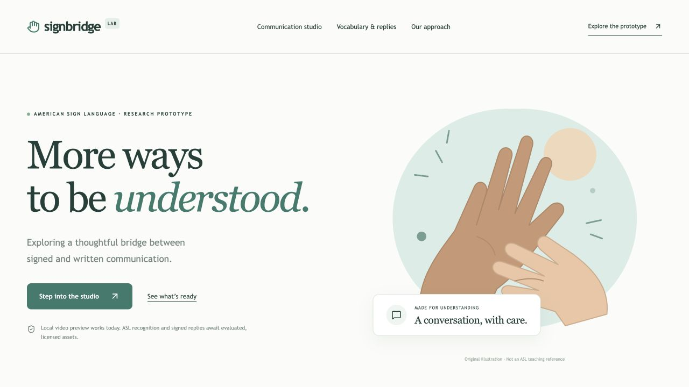
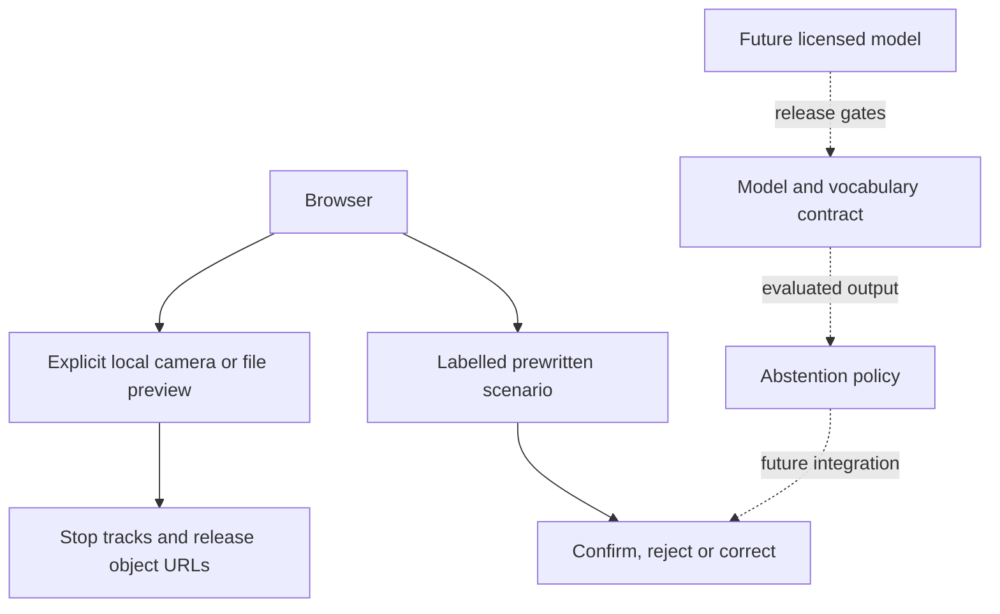

# SIGNBRIDGE

**A little room to connect.**

  



Watch the [permanent Project Room](https://lior-labspace.vercel.app/project-room): all three projects, English and French, with playback controls, downloadable MP4 files and readable transcripts. It does not require a local server.

## Overview

An accessibility-focused research interface for a future ASL communication assistant. This release supports local video preview and a clearly labelled confirmation-and-correction walkthrough. **It does not recognize ASL or produce signed video replies yet.**

## Try it

[Open the live SIGNBRIDGE demo](https://lior-signbridge.vercel.app). Deployed on Vercel Hobby and checked on 2026-10-01. Local startup is documented below. The in-app **How it works** page explains the implementation and its limits.

**Two-minute walkthrough:** Open /studio → read the research status → choose the prewritten walkthrough → reject the suggestion → type a correction → end the walkthrough → open the release checklist. Camera preview is optional.

## Features

- Explicit camera activation, video-only permission, visible capture state and cleanup on navigation or backgrounding.
- Local MP4 / WebM preview, up to 8 MB and 15 seconds. No upload endpoint and no retained conversations.
- A prewritten interface scenario with confirmation, rejection and manual correction. The suggestion is explicitly not model output.
- A tested abstention policy and model-manifest contract for a future evaluated model. Tests use synthetic labels, not ASL accuracy claims.
- A release-readiness page explaining data rights, signer-disjoint evaluation and the need for expert validation of full-phrase response videos.

## Architecture



See [Architecture](docs/ARCHITECTURE.md), [Deployment](docs/DEPLOYMENT.md) and [Verification](docs/VERIFICATION.md).

## Stack

Next.js App Router, React, strict TypeScript, Zod, Lucide, hand-written responsive CSS, Vitest and Playwright. Public pages use Server Components; interactive controls stay in small client components. GitHub Actions checks source quality, tests and builds.

No server database is needed for this release. Avoiding accounts and remote persistence reduces operational work and unnecessary personal data collection.

## Getting started

Node.js 24 LTS is recommended. Keep the checkout outside cloud-synced folders that may evict local files.

```bash
npm ci
cp .env.example .env
npm run build
npm run start
```

The default configuration makes no paid API requests. The development command is `npm run dev`.

## Tests

```bash
npm run check
npm run build
npx playwright install chromium
npm run test:e2e
```

The browser suite includes desktop and mobile-sized Chromium projects. Some restricted macOS agent environments cannot launch Chromium; this is an environment failure, not a passing test. See the verification record for what was actually executed.

## Environment and Docker

Copy `.env.example`; never commit `.env`. Optional providers are disabled without configuration. See [Deployment](docs/DEPLOYMENT.md) for required variables and limitations.

```bash
docker compose up --build
```

Docker configuration is supplied. A Docker build is not claimed as tested unless noted in the verification record.

## Project structure

```text
src/app/          Pages and route handlers
src/components/   Focused interactive UI
src/lib/          Types, validation and pure domain helpers
tests/            Domain tests and browser journeys
docs/             Architecture, evidence and learning guides
.github/          CI configuration
```

## Current limits and next steps

- No recognition model is installed. No real supported vocabulary, accuracy score, signer evaluation or measured inference latency is available.
- No authorized, ASL-reviewed response clips have been supplied. The site does not generate or concatenate signed sentences.
- This is not a replacement for an interpreter, and must not be used for medical, legal or other high-stakes communication.
- Research datasets are not automatically redistributable. See the feasibility review before downloading or publishing any signer media.

## Presentation and learning

- [English narrated demo](public/demo/walkthrough-en.mp4) · [Text version](public/demo/walkthrough-en.txt). Real interactions, edited, with synthetic narration and captions.
- [Reproducible demo](docs/DEMO.md).
- [French interview and learning guide](docs/INTERVIEW.fr.md) · [French narrated explanation](public/demo/walkthrough-fr.mp4).
- [Credits and rights](docs/CREDITS.md).
- [Contributing](CONTRIBUTING.md).

Built with AI assistance, with explicit tests and limitations. Understanding and explaining the implementation is part of the learning process. No invented users, usage metrics or performance claims are presented as real.

## License

Original application code: MIT. Third-party packages and media keep their own licences; see the credits file.
